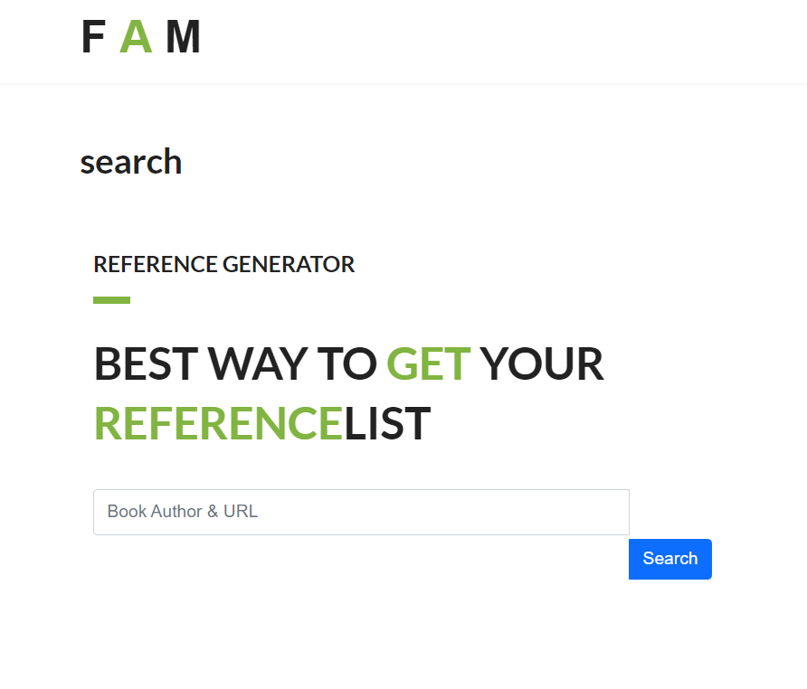

# Reference Generator 

## Table of Content
* [Project Links](#Project-Links)
* [Screenshots-Demo](#Screenshots)
* [Project Objective ](#Project-Objective)
* [Installation](#Installation)
* [Technologies](#Technologies)
* [Contact](#Contact)
* [License](#License)
## Project Links
[Github Repo](https://github.com/zoeshelly-tan/reference_generator)
[Heroku link](https://techblogzoeshelly.herokuapp.com/)

## Screenshots
Main page

## Project Objective
The project is design to build reference generator to assist the user in writing their assignments, projects and research article by offering the convience way on generating the reference list. 

## Installation
- Node.js 
- npm install

## Technologies
-      Node.js
-      Javascript
-      React js
-      Mongoodb
-      css
-      Semantic react ui
-      SuperAgent
-      Mobx

## Author Contact
Contact the author with any questions! 
Github link: [Shelly](https://github.com/zoeshelly-tan)
## License
This project is [MIT](https://choosealicense.com/licenses/MIT/) licensed.